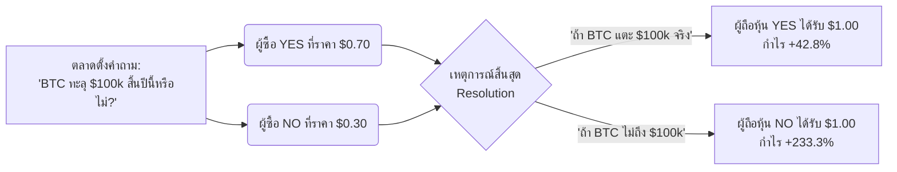
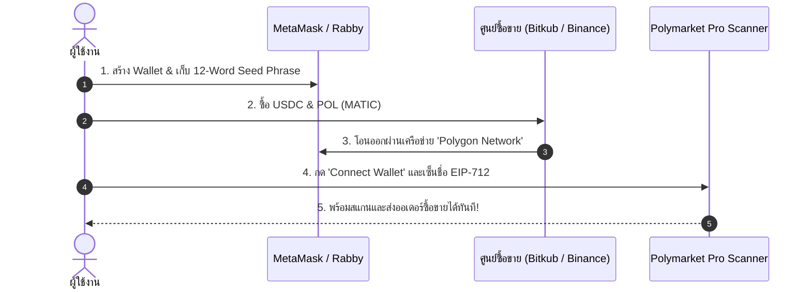
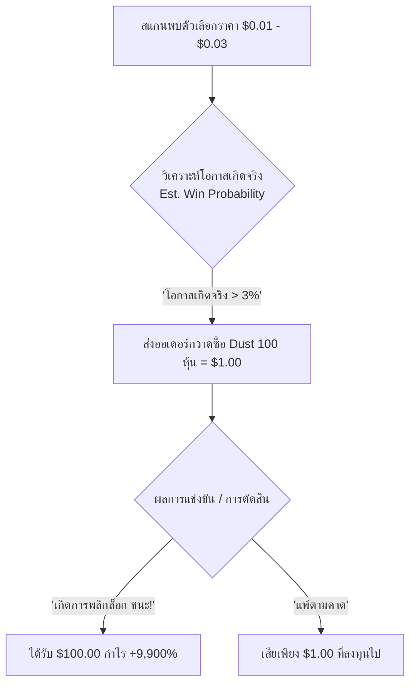
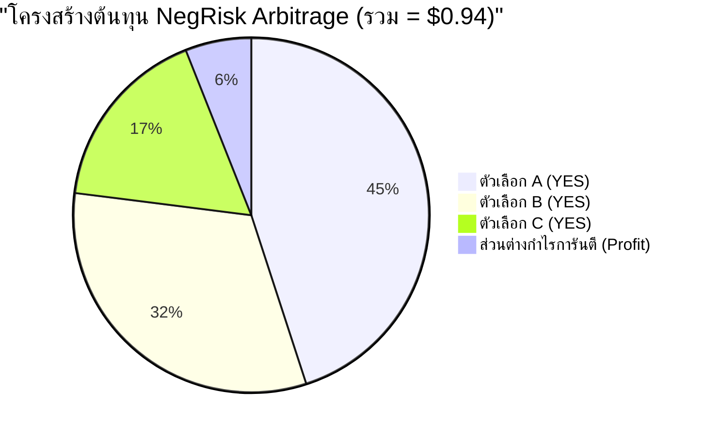
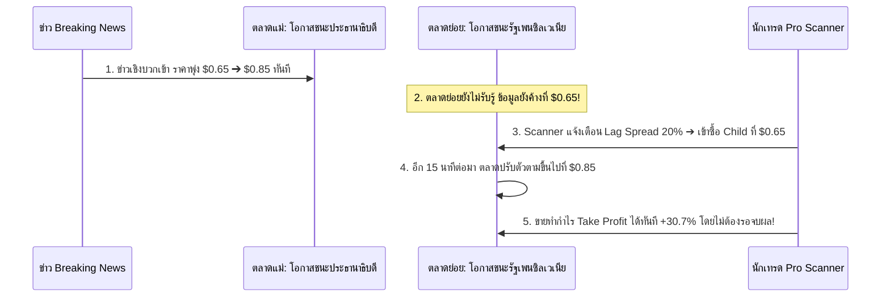
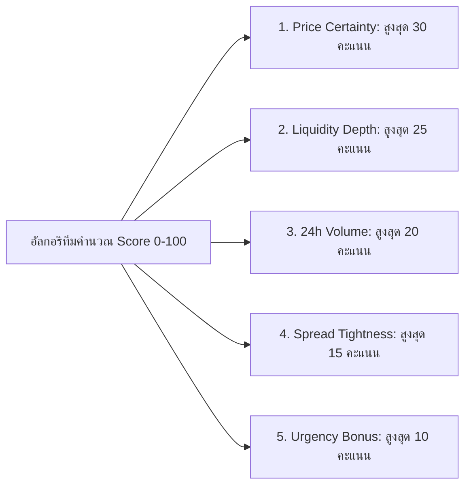

# 📚 คู่มือการใช้งาน Polymarket Pro Scanner ฉบับสมบูรณ์ (User Guide)
> **เวอร์ชัน:** 3.0 Pro Edition  
> **เหมาะสำหรับ:** ผู้เริ่มต้นลงทุนใน Crypto, เทรดเดอร์ Prediction Market, และนักล่า Arbitrage  
> **ภาษา:** ภาษาไทย (พร้อมคำศัพท์เทคนิคภาษาอังกฤษ)

---

## 📑 สารบัญ (Table of Contents)
- [บทที่ 1: Polymarket คืออะไร? (Prediction Market 101)](#บทที่-1-polymarket-คืออะไร-prediction-market-101)
- [บทที่ 2: วิธีสร้างกระเป๋าเงิน MetaMask และฝาก USDC บน Polygon](#บทที่-2-วิธีสร้างกระเป๋าเงิน-metamask-และฝาก-usdc-บน-polygon)
- [บทที่ 3: วิธีใช้งาน Scanner Dashboard (เจาะลึกทุกปุ่มและฟีเจอร์)](#บทที่-3-วิธีใช้งาน-scanner-dashboard-เจาะลึกทุกปุ่มและฟีเจอร์)
- [บทที่ 4: กลยุทธ์ 1c Dust Sweeping — ซื้อหุ้น 1 เซ็นต์ ลุ้นผลตอบแทน 100 เท่า](#บทที่-4-กลยุทธ์-1c-dust-sweeping--ซื้อหุ้น-1-เซ็นต์-ลุ้นผลตอบแทน-100-เท่า)
- [บทที่ 5: กลยุทธ์ NegRisk Arbitrage — ทำกำไรไร้ความเสี่ยง 100% (Guaranteed Profit)](#บทที่-5-กลยุทธ์-negrisk-arbitrage--ทำกำไรไร้ความเสี่ยง-100-guaranteed-profit)
- [บทที่ 6: กลยุทธ์ Cross-Market Lag — เก็งกำไรจากส่วนต่างราคาที่ล้าหลัง](#บทที่-6-กลยุทธ์-cross-market-lag--เก็งกำไรจากส่วนต่างราคาที่ล้าหลัง)
- [บทที่ 7: วิธีกดซื้อออเดอร์ผ่าน Order Ticket (Market vs Limit Order)](#บทที่-7-วิธีกดซื้อออเดอร์ผ่าน-order-ticket-market-vs-limit-order)
- [บทที่ 8: การอ่านค่า ROI%, Expected Value (EV), และ Score (0–100)](#บทที่-8-การอ่านค่า-roi-expected-value-ev-และ-score-0100)
- [บทที่ 9: FAQ คำถามที่พบบ่อยและการแก้ปัญหา](#บทที่-9-faq-คำถามที่พบบ่อยและการแก้ปัญหา)

---

## บทที่ 1: Polymarket คืออะไร? (Prediction Market 101)

### 1.1 ทำความเข้าใจ Prediction Market ใน 3 นาที 💡
**Polymarket** คือ ตลาดพยากรณ์เหตุการณ์ระดับโลก (Decentralized Information Markets) ที่สร้างขึ้นบนเทคโนโลยีบล็อกเชน (Polygon Network) ช่วยให้ผู้คนทั่วโลกสามารถใช้เงินดิจิทัล **USDC** ในการ "ซื้อ-ขายสิทธิ์ทายผล" ของเหตุการณ์จริงในอนาคตได้ เช่น:
- 🏛️ **การเมือง:** *“ใครจะชนะการเลือกตั้งประธานาธิบดีสหรัฐฯ?”*
- 🪙 **คริปโตเคอร์เรนซี:** *“Bitcoin จะแตะ $100,000 ภายในสิ้นปีหรือไม่?”*
- ⚽ **กีฬา:** *“ทีมชาติใดจะคว้าแชมป์ฟุตบอลโลก?”*
- 🌡️ **สภาพอากาศ / สังคม:** *“อุณหภูมิในลอนดอนจะทะลุ 40°C ในเดือนสิงหาคมหรือไม่?”*



### 1.2 กฎเหล็กพื้นฐานของราคาหุ้น (Share Price & Binary Outcome) ⚖️
1. **ราคาของ 1 หุ้น (Share) มีค่าระหว่าง $0.01 ถึง $0.99 เสมอ**
2. **ราคาหุ้น = ความน่าจะเป็นตามมุมมองของตลาด (Implied Probability)**  
   - เช่น ราคาหุ้น YES อยู่ที่ **$0.70** หมายความว่า ตลาดคาดว่ามีโอกาสเกิดเหตุการณ์นี้ **70%**
3. **เมื่อตลาดจบผล (Resolution):**
   - ฝั่งที่ **ชนะ (True Outcome)** จะได้รับเงินรางวัลจ่ายคืนเต็มจำนวน = **$1.00 ต่อ 1 หุ้น**
   - ฝั่งที่ **แพ้ (False Outcome)** จะมีมูลค่ากลายเป็น = **$0.00**

> [!TIP]
> **สูตรคำนวณกำไรพื้นฐาน:**  
> $\text{กำไรต่อหุ้น} = \$1.00 - \text{ราคาซื้อ}$  
> $\text{ROI (\%)} = \left( \frac{\$1.00 - \text{ราคาซื้อ}}{\text{ราคาซื้อ}} \right) \times 100$

---

## บทที่ 2: วิธีสร้างกระเป๋าเงิน MetaMask และฝาก USDC บน Polygon

Polymarket เป็นแพลตฟอร์มแบบ **Non-Custodial** (ไม่มีใครเก็บเงินของคุณไว้ คุณเป็นเจ้าของเงิน 100% ผ่าน Private Key) ดังนั้นคุณต้องมี Web3 Wallet



### 2.1 ขั้นตอนการติดตั้ง MetaMask (สำหรับคอมพิวเตอร์) 🦊
1. เข้าเว็บไซต์ทางการ: **[https://metamask.io](https://metamask.io)** (ระวังเว็บปลอม!)
2. กดติดตั้ง Extension บน Google Chrome, Brave, หรือ Microsoft Edge
3. เลือก **"Create a new wallet"** และตั้งรหัสผ่านประจำเครื่อง
4. **จดบันทึก Secret Recovery Phrase (12 คำ):**
   > [!CAUTION]
   > ห้ามแคปหน้าจอ ห้ามเซฟลง Google Drive หรือส่งในแชทเด็ดขาด! ให้จดลงกระดาษจริง 2 แผ่นแล้วเก็บในที่ปลอดภัย หากทำหายหรือถูกผู้อื่นรู้ เงินของคุณจะถูกขโมยและไม่สามารถกู้คืนได้

### 2.2 การเพิ่มและสลับเครือข่ายเป็น Polygon PoS (Chain ID 137) 🌐
Polymarket รันอยู่บนบล็อกเชน **Polygon (MATIC/POL)** เพื่อความรวดเร็วและค่าธรรมเนียม (Gas) ที่ถูกมาก (ไม่ถึง 1 บาทต่อธุรกรรม):
1. เปิดหน้าแดชบอร์ด **Polymarket Pro Scanner**
2. กดปุ่ม **🦊 Connect Wallet** ด้านขวาบน
3. หากกระเป๋าของคุณยังอยู่ที่ Ethereum หรือเครือข่ายอื่น ระบบจะเด้งหน้าต่างขอสลับเครือข่ายเป็น **Polygon Mainnet** ให้อัตโนมัติ เพียงกด **"Approve & Switch Network"**

### 2.3 การฝากเงิน USDC และเตรียมเหรียญ POL เป็นค่าแก๊ส 💵
คุณต้องเตรียมเหรียญ 2 ชนิดในกระเป๋า:
1. **USDC (Polygon Native):** เงินทุนหลักสำหรับซื้อสัญญาเดิมพัน
2. **POL (หรือเดิมชื่อ MATIC):** สำหรับจ่ายค่าธรรมเนียมธุรกรรมเครือข่าย (เตรียมไว้เพียง 1–3 POL หรือประมาณ 30–100 บาท ก็ใช้ได้เป็นร้อยครั้ง)

#### 📌 ช่องทางการฝากเงินเข้ากระเป๋า:
| ช่องทาง | วิธีการ | ข้อดี | เหมาะสำหรับ |
| :--- | :--- | :--- | :--- |
| **กระดานเทรดไทย (Bitkub, InnovestX, Orbix)** | ซื้อ POL/USDC แล้วกดถอนไปยังที่อยู่กระเป๋า `0x...` ของคุณ โดยเลือกเครือข่าย **Polygon** | ใช้งานง่ายด้วยบัญชีธนาคารไทย | ผู้เริ่มต้นในไทย |
| **Global Exchange (Binance, Bybit, OKX)** | ซื้อ USDC แล้วเลือกถอนระบุ Network: **Polygon (MATIC)** | ค่าธรรมเนียมถอนต่ำมาก ($0.1–$0.5) | ผู้มีบัญชี International |
| **Cross-chain Bridge (Relay, Stargate)** | บริดจ์ USDC ข้ามมาจาก Arbitrum, Optimism หรือ Base | รวดเร็ว ไม่ต้องผ่าน CEX | ผู้ใช้ DeFi ทั่วไป |

---

## บทที่ 3: วิธีใช้งาน Scanner Dashboard (เจาะลึกทุกปุ่มและฟีเจอร์)

หน้าจอแดชบอร์ดของ Polymarket Pro Scanner ถูกออกแบบมาให้รวบรวมข้อมูลระดับสถาบัน เพื่อคัดกรองโอกาสความแม่นยำสูง (High Win-Rate) แบบ Real-time

```
┌────────────────────────────────────────────────────────────────────────────────────────┐
│ 🎯 Polymarket PRO SCANNER       [ 🔍 ค้นหาตลาด... ⌘K ]     🔔 Alerts   ⚡ Quant   🦊 0x1a2b... │
├──────────────┬─────────────────────────────────────────────────────────────────────────┤
│ 🏠 Dashboard │ [🎯 เป้าหมาย 87%-95%]    [📊 สถิติตลาด 1,500 รายการ]    [⚡ Latency: 19.2s]   │
│ ⚡ Quant Suite├─────────────────────────────────────────────────────────────────────────┤
│ 📊 Portfolio │ หมวดหมู่: [🔥 ทั้งหมด] [🪙 Crypto] [⚽ Sports] [🏛️ Politics] [🌡️ Weather]    │
│ ⭐ Watchlist │ เรียงตาม: [⭐ Score สูงสุด] [📈 ราคา] [💧 สภาพคล่อง] [⏱️ จบเร็วสุด]          │
│              ├─────────────────────────────────────────────────────────────────────────┤
│ ── Trading ──│ ┌─────────────────────────────────────────────────────────────────────┐ │
│ 🎯 1c Dust   │ │ ⚽ Real Madrid vs Alaves - Real Madrid ชนะ                          │ │
│ ⚖️ NegRisk   │ │ ราคา: $0.92 (92%) │ สภาพคล่อง: $142,500 │ จบใน: 3 ชม. │ Score: 94/100 │ │
│ 🔗 Cross Lag │ │ [⭐ บันทึก]   [📊 ดูกราฟราคา]    [⚡ ซื้อหุ้นทันที: +8.7% ROI]         │ │
│ ⚙️ Config    │ └─────────────────────────────────────────────────────────────────────┘ │
└──────────────┴─────────────────────────────────────────────────────────────────────────┘
```

### 3.1 แถบเมนูด้านข้าง (Sidebar Navigation) 🧭
- **🏠 Dashboard:** หน้าหลักแสดงตลาดที่มีความน่าจะเป็นชนะสูง (High Certainty 87%–95%)
- **⚡ Quant Suite:** ศูนย์รวมเครื่องมือตรวจจับสัญญาณเทรดเชิงควอนต์ 3 สาย
- **📊 Portfolio Log:** บันทึกประวัติการส่งออเดอร์ทั้งแบบ Web3 จริงและแบบจำลอง (Paper Trading)
- **⭐ Watchlist:** รายการตลาดโปรดที่คุณกดติดดาวเพื่อเฝ้าติดตามความเคลื่อนไหว
- **🎯 1c Dust Sweeper:** หน้าจอเครื่องมือล่าหุ้น 1 เซ็นต์ ($0.01)
- **⚖️ NegRisk Spreads:** หน้าจอตลาด Arbitrage ผลรวมความน่าจะเป็นไม่เท่ากับ 100%
- **🔗 Cross-Market Lag:** หน้าจอตลาดที่มีความสัมพันธ์กันแต่ราคาขยับช้ากว่าปกติ
- **🔔 High Alerts:** แจ้งเตือนตลาดที่มีความมั่นใจสูงสุดและใกล้หมดเวลา
- **⚙️ Config:** ตั้งค่าเกณฑ์การกรอง (Min Price, Max Spread, Min Liquidity)

### 3.2 แถบควบคุมด้านบน (Top Bar Header) 🔍
- **Search Input (`⌘K`):** พิมพ์ค้นหาชื่อตลาดหรือคีย์เวิร์ดสำคัญ เช่น `Trump`, `Bitcoin`, `Champions League`
- **Last Scan Indicator:** แสดงเวลาการอัปเดตข้อมูลล่าสุดจาก Polymarket CLOB (อัปเดตอัตโนมัติทุก 20 วินาที)
- **🦊 Connect Wallet:** ปุ่มเชื่อมต่อกระเป๋าเงิน Web3 แสดงสถานะที่อยู่กระเป๋าแบบย่อ (เช่น `0x3a4...8f12`)

### 3.3 แผงตัวกรองและจัดเรียง (Filters & Sorters) 🏷️
1. **หมวดหมู่ (Categories):** กรองดูเฉพาะกลุ่มที่สนใจ:
   - `Crypto` (BTC, ETH, SOL, Airdrop, ETF)
   - `Sports` (ฟุตบอลพรีเมียร์ลีก, ยูฟ่า, NBA, เทนนิส, F1)
   - `Politics` (การเลือกตั้งสหรัฐฯ, กฎหมาย, ประชามติ)
   - `Weather` (พายุ, คลื่นความร้อน, อุณหภูมิทุบสถิติ)
   - `Twitter/Social` (ยอดทวีตของ Elon Musk, สถิติช่อง YouTube)
2. **การจัดเรียง (Sorting Criteria):**
   - **Score (0–100):** เรียงตามคะแนนความคุ้มค่าโดยรวมของสูตร Quant
   - **Price (สูง ➔ ต่ำ):** ตลาดที่มีโอกาสชนะสูงสุด (ความเสี่ยงต่ำสุด)
   - **Liquidity (ลึกสุด):** ตลาดที่มีเงินหมุนเวียนสูง ปลอดภัยจาก Slippage
   - **ROI% (ผลตอบแทนสูงสุด):** ตลาดที่ยังมีช่องว่างกำไรสูง
   - **Ending Soon (หมดเวลาเร็วสุด):** ตลาดที่กำลังจะตัดสินผลภายใน 1–24 ชั่วโมงเพื่อคืนทุนไว

---

## บทที่ 4: กลยุทธ์ 1c Dust Sweeping — ซื้อหุ้น 1 เซ็นต์ ลุ้นผลตอบแทน 100 เท่า

### 4.1 ตรรกะเบื้องหลังกลยุทธ์ (The Asymmetric Longshot Edge) 🎯
ในบางเหตุการณ์ ผู้คนในตลาดมักเทขายตัวเลือกที่คิดว่า "ไม่มีทางเกิดขึ้น" จนราคาตกลงไปแตะ **$0.01 (1 เซ็นต์)** หรือ **$0.02 (2 เซ็นต์)**  
แต่ในโลกความจริง เหตุการณ์พลิกล็อก (Black Swan Events หรือ Comeback) เกิดขึ้นบ่อยกว่า 1% เสมอ!



### 4.2 ตัวอย่างการคำนวณด้วยตัวเลขจริง 💰
สมมติคุณกระจายเงินลงทุน **$100 USDC** ในตัวเลือก 1 เซ็นต์ ($0.01) จำนวน **100 ตลาดที่แตกต่างกัน** (ตลาดละ $1 ได้ 100 หุ้น):

$$\begin{aligned}
\text{เงินลงทุนรวม} &= 100 \text{ ตลาด} \times \$1.00 = \$100.00 \\
\text{ผลลัพธ์ที่ } 1\text{ (แพ้ } 98 \text{ ตลาด, ชนะเพียง } 2 \text{ ตลาด):} \\
\text{เงินรางวัลที่ได้รับ} &= 2 \text{ ตลาด} \times (100 \text{ หุ้น} \times \$1.00) = \$200.00 \\
\text{กำไรสุทธิ (Net Profit)} &= \$200.00 - \$100.00 = +\$100.00 \\
\text{อัตราผลตอบแทน (Net ROI)} &= \mathbf{+100.00\%}
\end{aligned}$$

> [!IMPORTANT]
> **กฎเหล็กการเทรด 1c Dust:**
> 1. **ห้าม All-in ในตลาดเดียวเด็ดขาด:** ต้องกระจายเงินไม่เกิน 1%–2% ของพอร์ตต่อหนึ่งตัวเลือก
> 2. **เลือกเฉพาะตลาดที่มี Catalysts:** เช่น มวยที่มีโอกาสน็อกเอาต์, ผลกีฬาที่ทีมรองยังมีเวลาเหลือ, หรือตัวเลือกการเมืองรอบคัดเลือก

---

## บทที่ 5: กลยุทธ์ NegRisk Arbitrage — ทำกำไรไร้ความเสี่ยง 100% (Guaranteed Profit)

### 5.1 หลักการ Negative Risk Implied Sum Arbitrage ⚖️
ในเหตุการณ์ที่มีผลลัพธ์แบบเลือกได้เพียงหนึ่งเดียว (Mutually Exclusive) เช่น *"ใครจะเป็นผู้ชนะรางวัล Best Actor ในงาน Oscars?"* หรือ *"พรรคใดจะครองเสียงข้างมากในสภา?"*
ผลรวมของความน่าจะเป็นของทุกตัวเลือก **จะต้องเท่ากับ 1.00 ($1.00) พอดีเสมอ**

อย่างไรก็ตาม เนื่องจากตลาดมีผู้ซื้อขายกระจายกันในหลาย Order Book ทำให้เกิดความไร้ประสิทธิภาพ (Inefficiency):
- **กรณี Underpriced ($\sum \text{YES} < \$1.00$):**  
  ถ้าคุณกวาดซื้อ YES ครบทุกตัวเลือกด้วยต้นทุนรวมเพียง **$0.94** เมื่อผลสรุปออก ไม่ว่าใครจะชนะ คุณจะได้รับเงินรางวัล **$1.00 การันตี 100%**  
  $$\text{กำไรทันทีแบบไร้ความเสี่ยง} = \$1.00 - \$0.94 = +\$0.06 \text{ ต่อชุด} \ (+6.38\% \text{ Net ROI})$$



### 5.2 ตัวอย่างตารางคำนวณจำลองพอร์ต $1,000 📊

| รายการตัวเลือกในตลาด | ราคา YES ที่ระบบสแกนได้ | ซื้อจำนวน (หุ้น) | ยอดเงินลงทุน (USDC) |
| :--- | :--- | :--- | :--- |
| 🎬 ผู้เข้าชิง A | $0.450 | 1,063.8 หุ้น | $478.71 |
| 🎬 ผู้เข้าชิง B | $0.320 | 1,063.8 หุ้น | $340.42 |
| 🎬 ผู้เข้าชิง C | $0.170 | 1,063.8 หุ้น | $180.85 |
| **รวมต้นทุนซื้อทุกตัวเลือก** | **$\sum = \$0.940$** | **1,063.8 ชุด** | **$1,000.00 USDC** |
| 🏆 **เงินรางวัลการันตีเมื่อจบผล** | **$\$1.000$ ต่อชุด** | **1,063.8 ชุด** | **$1,063.83 USDC** |
| 💵 **กำไรสุทธิล็อกในมือ** | **$0.060 ต่อชุด** | — | **+$63.83 USDC (+6.38%)** |

> [!TIP]
> หน้าจอ **⚡ Quant Suite ➔ แท็บ ⚖️ NegRisk Spreads** ในระบบของเราจะคำนวณและสรุปตลาดที่มีผลรวมราคาเบี่ยงเบน พร้อมปุ่ม **⚖️ Buy Arbitrage** ให้คุณกดทำกำไรได้ในคลิกเดียว!

---

## บทที่ 6: กลยุทธ์ Cross-Market Lag — เก็งกำไรจากส่วนต่างราคาที่ล้าหลัง

### 6.1 กลไก Information Dissemination Lag 🔗
บ่อยครั้งที่ข่าวสารหรือราคาใน **ตลาดแม่ (Macro / Parent Market)** ที่มีสภาพคล่องสูง มีการขยับตัวอย่างรวดเร็ว เช่น ผลการเลือกตั้งประธานาธิบดีภาพรวม หรือการประกาศลดดอกเบี้ยของธนาคารกลางสหรัฐฯ (Fed)  
แต่ **ตลาดย่อย (Micro / Child Market)** เช่น ผลคะแนนรายรัฐ (Swing States) หรือตลาดคู่ขนาน กลับยัง **ปรับตัวช้ากว่า (Lagging)** เนื่องจากสภาพคล่องในหน้านั้นน้อยกว่า



### 6.2 จุดสังเกตและการเข้าทำกำไร 🎯
- **เกณฑ์คัดกรอง:** ระบบจะจับคู่ตลาดที่มีคำสำคัญตรงกันและมี **ส่วนต่างของราคา (Divergence Spread) ตั้งแต่ 12% ขึ้นไป**
- **Action:** 
  - หากตลาดแม่ราคาขึ้น แต่วอลุ่มตลาดย่อยยังล้าหลัง ➔ **"BUY CHILD (Lagging Up)"**
  - คุณสามารถถือจนตลาดปรับราคามาเท่ากันแล้วกดขายในกระดานได้ทันที (Front-running the market)

---

## บทที่ 7: วิธีกดซื้อออเดอร์ผ่าน Order Ticket (Market vs Limit)

เมื่อคุณพบคู่ตลาดที่น่าสนใจ ให้กดปุ่ม **⚡ Buy Share** หรือ **⚡ Snipe Share** บนการ์ดตลาด เพื่อเปิดหน้าต่าง **Order Execution Ticket**

```
┌──────────────────────────────────────────────────────────┐
│ ⚡ EXECUTE ORDER TICKET                               [X] │
├──────────────────────────────────────────────────────────┤
│ ⚽ Real Madrid vs Alaves — Real Madrid ชนะ                │
│ Target Outcome: [ YES ($0.920) ]                         │
├──────────────────────────────────────────────────────────┤
│ Order Type:   [● Market Order (ทันที)]  [○ Limit Order]   │
│ Execution:    [● Web3 Direct Sign]     [○ Paper Trading] │
├──────────────────────────────────────────────────────────┤
│ Investment Amount (USDC):                                │
│ [  100  ] USDC    [ $50 ]  [ $100 ]  [ $500 ]  [ $1,000 ]│
├──────────────────────────────────────────────────────────┤
│ 📊 Order Summary:                                        │
│ • Estimated Shares:  108.7 Shares @ $0.920               │
│ • Estimated Payout:  $108.70 USDC                        │
│ • Net Potential ROI: +8.70%                              │
├──────────────────────────────────────────────────────────┤
│             [ ⚡ Confirm & Submit Order ]                 │
└──────────────────────────────────────────────────────────┘
```

### 7.1 เปรียบเทียบ Market Order vs Limit Order 📋

| คุณสมบัติ | Market Order (คำสั่งซื้อทันที) | Limit Order (คำสั่งตั้งราคาล่วงหน้า) |
| :--- | :--- | :--- |
| **ความเร็วในการจับคู่** | แมตช์ทันทีกับราคาที่ดีที่สุดใน Order Book | ออเดอร์จะถูกตั้งรอจนกว่าจะมีคนมาขายในราคาที่ตั้งไว้ |
| **สถานะคำสั่ง** | **Taker** | **Maker** |
| **ค่าธรรมเนียม (Polymarket Fees)** | 0% ถึงต่ำมาก | **0% Maker Rebates** |
| **ความแน่นอนของราคา** | อาจเกิด Slippage เล็กน้อยหากซื้อไม้ใหญ่ | **ได้ราคาที่ต้องการแน่นอน 100%** |
| **กรณีที่ควรใช้** | เมื่อต้องการเข้าซื้อด่วนในตลาดที่กำลังจะปิด | เมื่อต้องการดักซื้อของถูก (เช่น ดักซื้อที่ $0.88 เมื่อราคาตลาดอยู่ที่ $0.92) |

### 7.2 โหมดการส่งคำสั่ง (Execution Modes) 🛠️
1. **🦊 Web3 Wallet Direct Sign (แนะนำสำหรับการเทรดจริง):**
   - ส่งคำสั่งตรงเข้า Polymarket CLOB (Central Limit Order Book)
   - ใช้มาตรฐาน **EIP-712 Signature** ปลอดภัยสูง ไม่ต้องส่ง Private Key ให้เซิร์ฟเวอร์
   - ตรวจสอบความถูกต้องและตัดเงิน USDC จากกระเป๋า MetaMask ของคุณโดยตรง
2. **📝 Paper Trade Simulation (แนะนำสำหรับมือใหม่):**
   - จำลองการเทรดโดยไม่ใช้เงินจริง
   - บันทึกเข้าฐานข้อมูล **Portfolio Log** เพื่อทดสอบ Win Rate และความแม่นยำของกลยุทธ์ก่อนลงเงินจริง
3. **🚀 Live CLOB API:**
   - ส่งผ่าน REST API สำหรับผู้ใช้ที่ผูก API Key บอทระดับสถาบัน

---

## บทที่ 8: การอ่านค่า ROI%, Expected Value, และ Score

ระบบ Polymarket Pro Scanner คำนวณค่าทางสถิติและคณิตศาสตร์การเงินให้คุณตัดสินใจได้ง่ายในเสี้ยววินาที



### 8.1 องค์ประกอบของ Score (0 – 100 คะแนน) 🏆
- **ความแน่นอนของราคา (Price Certainty - 30%):** ให้คะแนนสูงเมื่อราคาอยู่ในช่วง $0.87 ถึง $0.95 (โอกาสชนะ 87%–95%)
- **ความลึกของสภาพคล่อง (Liquidity Depth - 25%):** คำนวณแบบ Logarithmic Scale ให้คะแนนเต็มเมื่อตลาดมีสภาพคล่องสูงกว่า $500,000
- **ปริมาณการซื้อขาย 24 ชม. (24h Volume - 20%):** สะท้อนความสนใจของตลาดและเม็ดเงินหมุนเวียน
- **ความแคบของส่วนต่าง Bid-Ask (Spread Tightness - 15%):** ยิ่ง Spread แคบ แปลว่าต้นทุนการเข้าซื้อต่ำ
- **ความเร่งด่วนของเวลา (Urgency Time Bonus - 10%):** 
  - จบภายใน 1 ชม. ➔ ได้โบนัส +10 คะแนน
  - จบภายใน 6 ชม. ➔ ได้โบนัส +8 คะแนน
  - จบภายใน 24 ชม. ➔ ได้โบนัส +5 คะแนน

> [!NOTE]
> **เกณฑ์การคัดเลือกเกรดของดีล (Deal Grading):**
> - **Score $\ge$ 85:** 🌟 **Grade A+ (High Conviction)** — โอกาสทอง สภาพคล่องสูง จบไว แนะนำเข้าลงทุน
> - **Score 70 – 84:** 🟢 **Grade B (Solid Setup)** — ตลาดมาตรฐาน ผลตอบแทนคุ้มค่า
> - **Score < 70:** 🟡 **Grade C (Speculative)** — ตลาดสภาพคล่องต่ำ หรือเวลารอคอยยาวนาน

### 8.2 Expected Value (EV) และ Net ROI% 📐
- **Net ROI (%):** อัตราผลตอบแทนสุทธิหากสัญญาชนะ  
  $$\text{ROI (\%)} = \frac{\$1.00 - \text{Price}}{\text{Price}} \times 100$$
  *ตัวอย่าง:* ซื้อหุ้นที่ $0.91 ➔ ROI = \frac{1.00 - 0.91}{0.91} \times 100 = \mathbf{+9.89\%}$
- **Expected Value (EV):** มูลค่าความคาดหวังทางคณิตศาสตร์ต่อ 1 ดอลลาร์ที่ลงทุน  
  $$\text{EV} = (\text{Win Probability} \times \$1.00) - \text{Purchase Price}$$
  *ตัวอย่าง:* ซื้อหุ้น 1 เซ็นต์ ($0.01) แต่มีโอกาสเกิดจริง 5% (0.05)  
  $$\text{EV} = (0.05 \times \$1.00) - \$0.01 = \mathbf{+\$0.040} \ (\text{เป็นบวกสูงมาก})$$

---

## บทที่ 9: FAQ คำถามที่พบบ่อย

### Q1: แพลตฟอร์มนี้ปลอดภัยหรือไม่? เงินของฉันถูกเก็บไว้ที่ไหน? 🛡️
**ตอบ:** ปลอดภัยสูงสุด เพราะระบบเป็นแบบ **Non-Custodial** 100% เราไม่มีการเก็บ Private Key หรือเงินของผู้ใช้งาน เงิน USDC ทั้งหมดจะอยู่ในกระเป๋า MetaMask ส่วนตัวของคุณ และสัญญาการเดิมพันจะถูกล็อกอยู่ใน Smart Contract มาตรฐานของ Polymarket บนเครือข่าย Polygon

### Q2: ค่าธรรมเนียมในการเทรดบน Polymarket คิดอย่างไร? 💸
**ตอบ:** Polymarket มีจุดเด่นคือ **0% Maker Fees** (หากตั้ง Limit Order จะไม่เสียค่าธรรมเนียม) และค่าธรรมเนียมเครือข่าย Polygon (Gas Fee) ถูกมากเฉลี่ยประมาณ $0.001–$0.01 ต่อรายการเท่านั้น

### Q3: ใครเป็นคนตัดสินว่าเหตุการณ์ไหนชนะ (Resolution Dispute)? 🏛️
**ตอบ:** Polymarket ใช้ระบบ Decentralized Oracle ของ **UMA Protocol (Optimistic Oracle)** ร่วมกับแหล่งข่าวและข้อมูลทางการที่ระบุไว้ในข้อตกลงของแต่ละตลาด ทำให้ไม่มีใครสามารถโกงผลการตัดสินได้

### Q4: หากต้องการถอนเงินกลับเป็นเงินบาทไทย (THB) ต้องทำอย่างไร? 🇹🇭
**ตอบ:** ทำได้ง่ายใน 3 ขั้นตอน:
1. กดรับเงินรางวัลชนะ (Redeem) บน Polymarket เพื่อรับ USDC กลับเข้ากระเป๋า MetaMask
2. โอนเหรียญ USDC จาก MetaMask ไปยังกระดานเทรดไทยที่รองรับ Polygon เช่น **Bitkub** หรือ **InnovestX**
3. ขาย USDC เป็นเงินบาท (THB) แล้วกดถอนเข้าบัญชีธนาคารไทยได้ทันที

### Q5: ทำไมบางครั้งกดซื้อแล้วระบบแจ้งเตือนว่า Slippage สูง? ⚠️
**ตอบ:** เกิดจากสภาพคล่อง (Liquidity Depth) ใน Order Book ของตลาดนั้นมีน้อยเกินไปเมื่อเทียบกับขนาดเงินที่คุณต้องการซื้อ วิธีแก้คือ: ลดขนาดไม้การลงทุนลง หรือเปลี่ยนจากการใช้ Market Order มาเป็นการตั้ง **Limit Order** ตามราคาที่คุณพอใจ

---
*จัดทำโดย: ทีมวิจัยและพัฒนาการศึกษา Polymarket Pro Scanner (Agent 08 - Strategy Education AI)*
